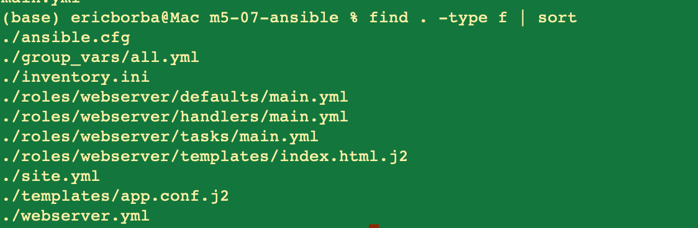
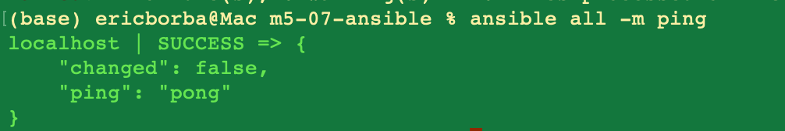
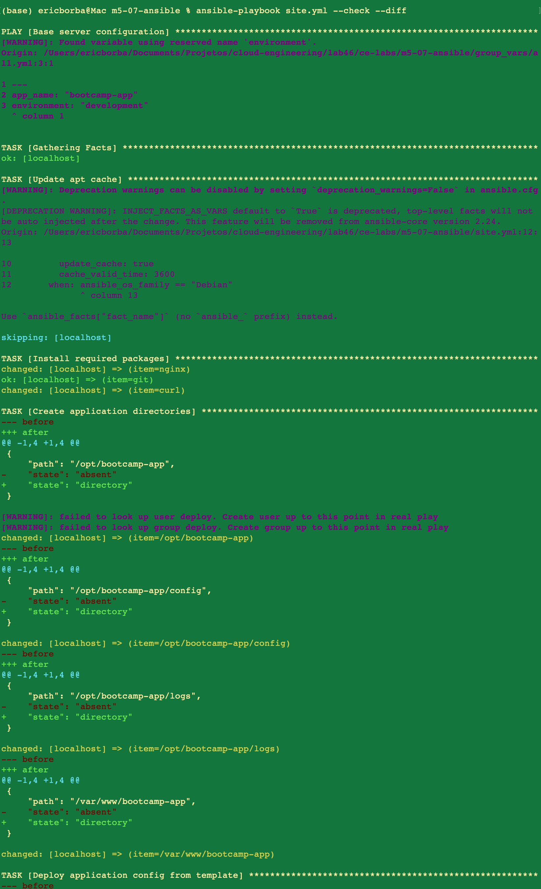
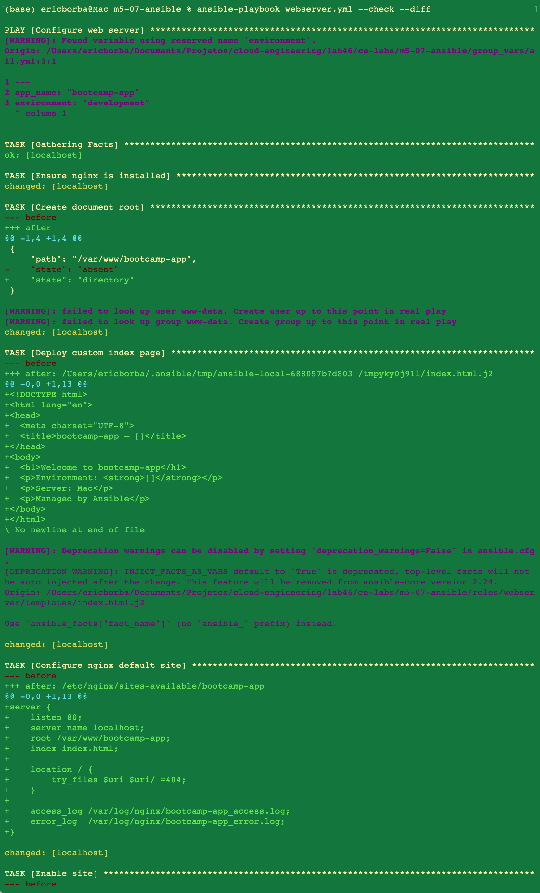
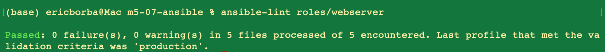
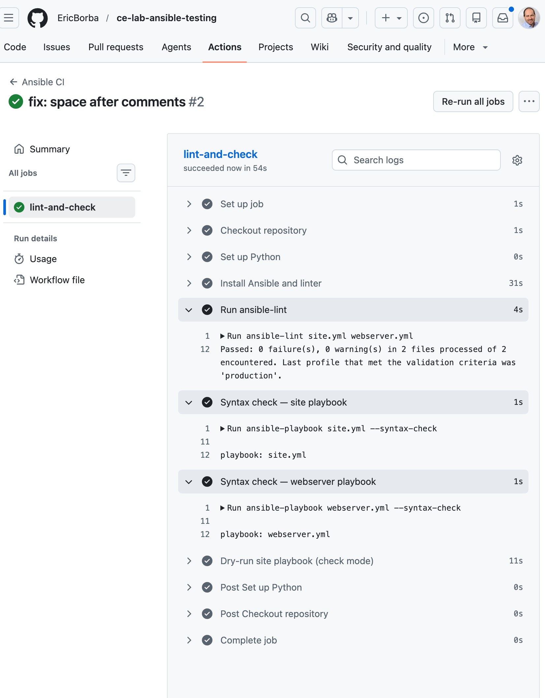

# Ansible Automation Lab — m5-07

This lab covers core Ansible concepts: inventory management, playbook authoring, variable handling with `group_vars`, Jinja2 templating, role structure, and CI/CD integration via GitHub Actions.

---

## Project Structure

```
m5-07-ansible/
├── ansible.cfg                        # Ansible configuration
├── inventory.ini                      # Host inventory (localhost)
├── group_vars/
│   └── all.yml                        # Shared variables for all hosts
├── site.yml                           # Base server configuration playbook
├── webserver.yml                      # Web server configuration playbook
├── templates/
│   └── app.conf.j2                    # Application config template
├── roles/
│   └── webserver/
│       ├── defaults/main.yml          # Role default variables
│       ├── handlers/main.yml          # Role handlers (nginx restart)
│       ├── tasks/main.yml             # Role tasks
│       └── templates/index.html.j2   # Jinja2 HTML template
└── .github/
    └── workflows/
        └── ansible-ci.yml            # CI pipeline definition
```

---

## Configuration

### Inventory (`inventory.ini`)

Both playbooks target `localhost` using a local connection, simulating a managed host without requiring SSH:

```ini
[local]
localhost ansible_connection=local ansible_python_interpreter=/usr/bin/python3

[webservers]
localhost ansible_connection=local ansible_python_interpreter=/usr/bin/python3
```

### Group Variables (`group_vars/all.yml`)

Shared variables available to all plays:

| Variable | Value | Description |
|---|---|---|
| `app_name` | `bootcamp-app` | Application identifier |
| `environment` | `development` | Deployment environment |
| `app_port` | `8080` | Application port |
| `deploy_user` | `deploy` | Owner of application files |
| `nginx_server_name` | `localhost` | nginx `server_name` directive |
| `nginx_worker_processes` | `2` | nginx worker count |
| `packages` | nginx, git, curl | System packages to install |
| `app_directories` | `/opt/bootcamp-app`, `/opt/bootcamp-app/config`, `/opt/bootcamp-app/logs`, `/var/www/bootcamp-app` | Directories to create |

---

## Playbooks

### `site.yml` — Base server configuration

Targets the `[local]` group and handles base OS-level setup:

- Updates the apt cache (Debian-family only)
- Installs required system packages from `{{ packages }}`
- Creates application directories from `{{ app_directories }}`
- Deploys the application config from `templates/app.conf.j2`
- Prints a configuration summary via the debug module

### `webserver.yml` — Web server configuration

Targets the `[webservers]` group and configures nginx to serve the application:

- Installs nginx
- Creates the document root at `/var/www/{{ app_name }}`
- Deploys a Jinja2-rendered `index.html` from the role template
- Writes the nginx virtual host config to `/etc/nginx/sites-available/{{ app_name }}`
- Enables the site by symlinking into `sites-enabled/`
- Triggers a handler to reload nginx on config changes

---

## Role: `webserver`

The `webserver` role encapsulates the nginx configuration logic for reuse across playbooks.

### Default Variables (`roles/webserver/defaults/main.yml`)

| Variable | Default |
|---|---|
| `webserver_port` | `80` |
| `webserver_document_root` | `/var/www/html` |
| `webserver_server_name` | `localhost` |
| `webserver_packages` | `[nginx]` |

### Tasks (`roles/webserver/tasks/main.yml`)

1. Install packages listed in `webserver_packages`
2. Create the document root directory with `www-data` ownership
3. Deploy `index.html.j2` template to the document root
4. Ensure nginx is started and enabled

### Handlers (`roles/webserver/handlers/main.yml`)

- **Restart nginx** — triggered by the template deployment task when the index page changes

### Template (`roles/webserver/templates/index.html.j2`)

Renders a simple HTML page using `app_name`, `environment`, and `ansible_hostname` facts:

```html
<h1>Welcome to {{ app_name }}</h1>
<p>Environment: <strong>{{ environment }}</strong></p>
<p>Server: {{ ansible_hostname }}</p>
<p>Managed by Ansible</p>
```

---

## CI/CD Pipeline

A GitHub Actions workflow (`.github/workflows/ansible-ci.yml`) runs on every push and pull request to `main`.

### Pipeline Steps

| Step | Command |
|---|---|
| Install dependencies | `pip install ansible ansible-lint` |
| Lint playbooks | `ansible-lint site.yml webserver.yml` |
| Syntax check site playbook | `ansible-playbook site.yml --syntax-check` |
| Syntax check webserver playbook | `ansible-playbook webserver.yml --syntax-check` |
| Dry-run site playbook | `ansible-playbook site.yml --check --diff` |

---

## Validation Steps & Evidence

### 1. Project file structure

```bash
find . -type f | sort
```



### 2. Connectivity test — ansible ping

```bash
ansible all -m ping
```



### 3. site.yml — check mode dry run

```bash
ansible-playbook site.yml --check --diff
```



### 4. webserver.yml — check mode dry run

```bash
ansible-playbook webserver.yml --check --diff
```



### 5. ansible-lint — role validation

```bash
ansible-lint roles/webserver
```



### 6. GitHub Actions CI pipeline — all checks passed


